# SwipeRecyclerView

作者的主页：[https://www.yanzhenjie.com](https://www.yanzhenjie.com)  
技术交流群：[46505645](https://jq.qq.com/?_wv=1027&k=5wY8UWl)  

----

本库是基于RecyclerView的封装，提供了Item侧滑菜单、Item滑动删除、Item长按拖拽、添加HeaderView/FooterView、加载更多、Item点击监听等基本功能。

## 特性
1. Item侧滑菜单，支持水平分布、垂直分布
2. Item长按拖拽、侧滑删除
3. 添加/移除HeaderView/FooterView
4. **自动/点击**加载更多的功能
5. 支持二级列表，List形式、Grid形式、Staggered形式
6. Sticky普通布局黏贴和RecyclerView分组黏贴
7. 支持AndroidX

> 使用本库只需要使用SwipeRecyclerView即可，用法和原生RecyclerView一模一样，本库比原生的RecyclerView多了几个扩展方法。

## 截图
对上面提到的效果基本都有演示，但不是全部，更多效果可以下载Demo查看。

### Item侧滑菜单
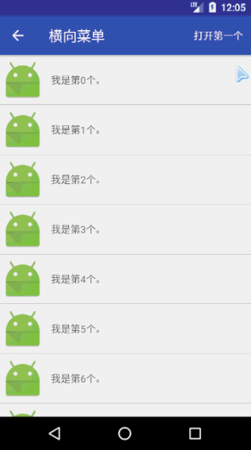 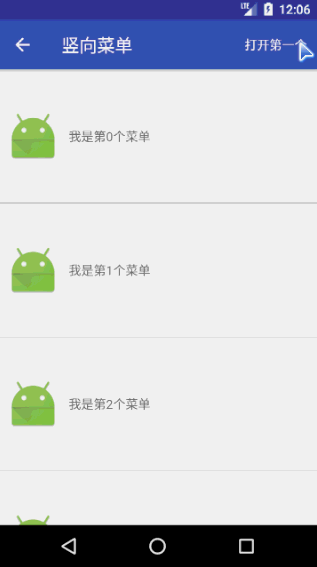 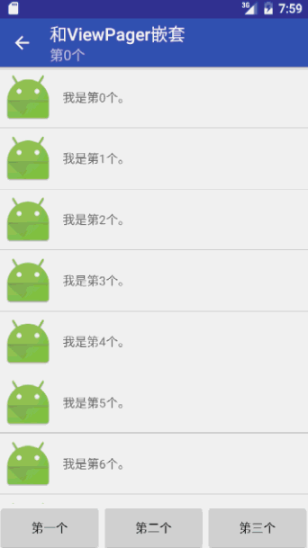

### Item侧滑删除、拖拽
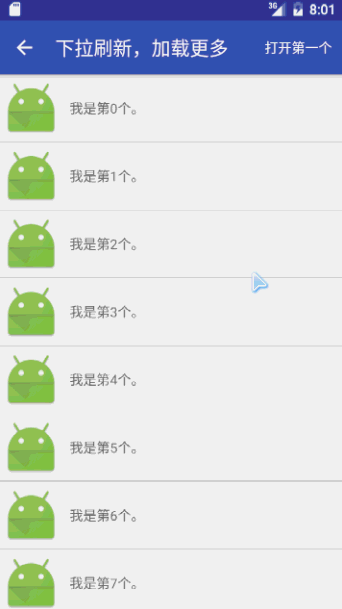 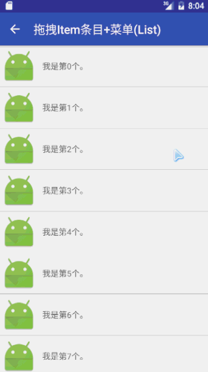 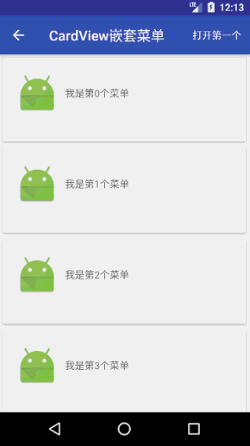

### 下拉刷新和加载更多
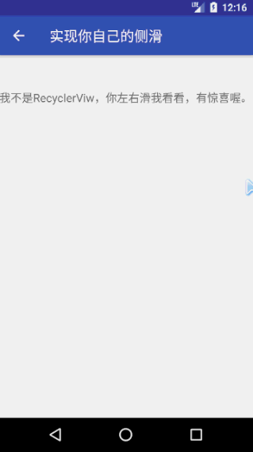

### HeaderView和FooterView
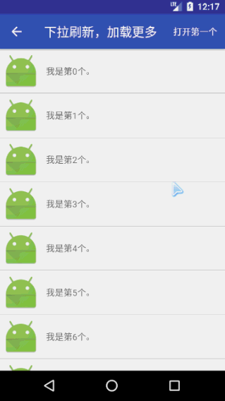

### Sticky效果和Item分组
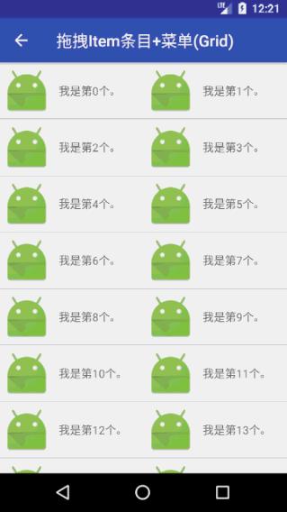  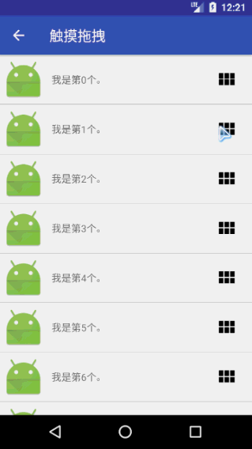

### 和DrawerLayout嵌套
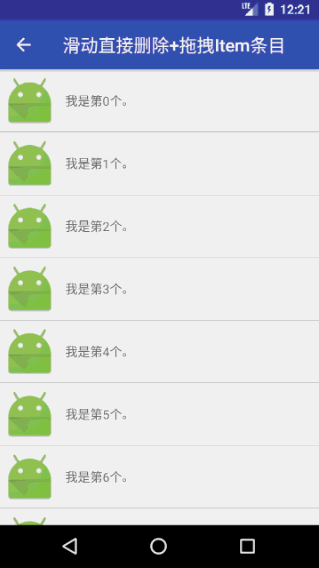

## 如何使用
如果你使用的是android support库，那么请添加下述依赖：
```groovy
implementation 'com.yanzhenjie.recyclerview:support:1.3.2'
```

如果你使用的是android x库，那么请添加下述依赖：
```groovy
implementation 'com.github.luqiming666:SwipeRecyclerView:1.4.8'
```
**注意** 记得在build.gradle中加入
```groovy
maven {
     url 'https://jitpack.io'
}
```

> **1. SwipeRecyclerView从1.3.0版本开始支持AndroidX和二级列表，因此相对于低版本的包名和类名有所改动，从低版本升级的开发者需要考量是否要升级。**  
**2. 为了让开发者方便切换support库和x库，SwipeRecyclerView的support库和x库除了依赖时的名称不一样外，包名、控件名和类名都是一样的，因此两个库不能共存。**  

### 加入布局
在布局的xml中加入`SwipeRecyclerView`：
```xml
<com.yanzhenjie.recyclerview.SwipeRecyclerView
    .../>
```

### ItemDecoration
也就是分割线，支持Grid形式和Linear形式，可以选择某个ViewType不画分割线：
```java
// 默认构造，传入颜色即可。
ItemDecoration itemDecoration = new DefaultDecoration(color);

// 或者：颜色，宽，高，最后一个参数是不画分割线的ViewType，可以传入多个。
itemDecoration = new DefaultDecoration(color, width, height, excludeViewType);

// 或者：例如下面的123都是不画分割线的ViewType：
itemDecoration = new DefaultDecoration(color, width, height, 1, 2, 3);

SwipeRecyclerView recyclerView = ...;
recyclerView.setDecoration(itemDecoration);
```

### Item点击监听
```java
recyclerView.setOnItemClickListener(new OnItemClickListener() {
    @Override
    public void onItemClick(View view, int position) {
        // TODO...
    }
});
```

### 侧滑菜单
```java
// 设置监听器。
swipeRecyclerView.setSwipeMenuCreator(mSwipeMenuCreator);

// 创建菜单：
SwipeMenuCreator mSwipeMenuCreator = new SwipeMenuCreator() {
    @Override
    public void onCreateMenu(SwipeMenu leftMenu, SwipeMenu rightMenu, int position) {
        SwipeMenuItem deleteItem = new SwipeMenuItem(mContext)
            ...; // 各种文字和图标属性设置。
        leftMenu.addMenuItem(deleteItem); // 在Item左侧添加一个菜单。

        SwipeMenuItem deleteItem = new SwipeMenuItem(mContext)
            ...; // 各种文字和图标属性设置。
        leftMenu.addMenuItem(deleteItem); // 在Item右侧添加一个菜单。
        
        // 注意：哪边不想要菜单，那么不要添加即可。
    }
};

// 菜单点击监听。
swipeRecyclerView.setOnItemMenuClickListener(mItemMenuClickListener);

OnItemMenuClickListener mItemMenuClickListener = new OnItemMenuClickListener() {
    @Override
    public void onItemClick(SwipeMenuBridge menuBridge, int position) {
        // 任何操作必须先关闭菜单，否则可能出现Item菜单打开状态错乱。
        menuBridge.closeMenu();
        
        // 左侧还是右侧菜单：
        int direction = menuBridge.getDirection();
        // 菜单在Item中的Position：
        int menuPosition = menuBridge.getPosition();
    }
};
```

**注意**：菜单需要设置高度，关于菜单高度：
1. `MATCH_PARENT`，自动适应Item高度，保持和Item一样高，比较推荐;
2. 指定具体的高，比如80;
3. `WRAP_CONTENT`，自身高度，极不推荐;

### 侧滑删除和拖拽
拖拽和侧滑删除的功能默认关闭的，所以先要打开功能：
```java
recyclerView.setLongPressDragEnabled(true); // 拖拽排序，默认关闭。
recyclerView.setItemViewSwipeEnabled(true); // 侧滑删除，默认关闭。
```

只需要设置上面两个属性就可以进行相应的动作了，如果不需要哪个，不要打开就可以了。

然后监听拖拽和侧滑的动作，进行数据更新：
```java
recyclerView.setOnItemMoveListener(mItemMoveListener);// 监听拖拽，更新UI。

OnItemMoveListener mItemMoveListener = new OnItemMoveListener() {
    @Override
    public boolean onItemMove(ViewHolder srcHolder, ViewHolder targetHolder) {
        // 此方法在Item拖拽交换位置时被调用。
        // 第一个参数是要交换位置的Item，第二个是目标位置的Item。

        // 交换数据，并更新adapter。
        int fromPosition = srcHolder.getAdapterPosition();
        int toPosition = targetHolder.getAdapterPosition();
        Collections.swap(mDataList, fromPosition, toPosition);
        adapter.notifyItemMoved(fromPosition, toPosition);

        // 返回true，表示数据交换成功，ItemView可以交换位置。
        return true;
    }

    @Override
    public void onItemDismiss(ViewHolder srcHolder) {
        // 此方法在Item在侧滑删除时被调用。

        // 从数据源移除该Item对应的数据，并刷新Adapter。
        int position = srcHolder.getAdapterPosition();
        mDataList.remove(position);
        adapter.notifyItemRemoved(position);
    }
};
```

**特别注意**：如果`LayoutManager`是`List`形式，那么Item拖拽时只能从1-2-3-4这样走，如果你的`LayoutManager`是`Grid`形式的，那么Item可以从1直接到3或者5或者6...，这样数据就会错乱，所以**当`LayoutManager`是Grid形式时**这里要特别注意转换数据位置的算法：
```java
@Override
public boolean onItemMove(ViewHolder srcHolder, ViewHolder targetHolder) {
    int fromPosition = srcHolder.getAdapterPosition();
    int toPosition = targetHolder.getAdapterPosition();
    if (fromPosition < toPosition) {
        for (int i = fromPosition; i < toPosition; i++) {
            Collections.swap(mDataList, i, i + 1);
        }
    } else {
        for (int i = fromPosition; i > toPosition; i--) {
            Collections.swap(mDataList, i, i - 1);
        }
    }

    mMenuAdapter.notifyItemMoved(fromPosition, toPosition);
    return true;
}
```

我们还可以监听用户的侧滑删除和拖拽Item时的手指状态：
```java
recyclerView.setOnItemStateChangedListener(mStateChangedListener);

...

private OnItemStateChangedListener mStateChangedListener = (viewHolder, actionState) -> {
    if (actionState == OnItemStateChangedListener.ACTION_STATE_DRAG) {
        // 状态：正在拖拽。
    } else if (actionState == OnItemStateChangedListener.ACTION_STATE_SWIPE) {
        // 状态：滑动删除。
    } else if (actionState == OnItemStateChangedListener.ACTION_STATE_IDLE) {
        // 状态：手指松开。
    }
};
```

想用户触摸到某个`Item`时就开始拖拽或者侧滑删除时，只需要调用`startDrag()`和`startSwipe()`并转入当前`Item`的`ViewHoler`即可。

触摸拖拽：
```java
swipeRecyclerView.startDrag(ViewHolder);
```

触摸侧滑删除：
```java
swipeRecyclerView.startSwipe(ViewHolder);
```

### HeaderView和FooterView
主要方法：
```java
addHeaderView(View); // 添加HeaderView。
removeHeaderView(View); // 移除HeaderView。
addFooterView(View); // 添加FooterView。
removeFooterView(View); // 移除FooterView。
getHeaderItemCount(); // 获取HeaderView个数。
getFooterItemCount(); // 获取FooterView个数。
getItemViewType(int); // 获取Item的ViewType，包括HeaderView、FooterView、普通ItemView。
```
添加/移除`HeaderView`/`FooterView`和`setAdapter()`的调用不分先后顺序。

**特别注意**：
1. 如果添加了`HeaderView`，凡是通过`ViewHolder`拿到的`position`都要减掉`HeaderView`的数量才能得到正确的`position`。

### 加载更多
本库默认提供了加载更多的动画和View，开发者也可以自定义，默认支持`RecyclerView`自带的三种布局管理器。

默认加载更多：
```java
RecyclerView recyclerView = ...；
...

recyclerView.useDefaultLoadMore(); // 使用默认的加载更多的View。
recyclerView.setLoadMoreListener(mLoadMoreListener); // 加载更多的监听。

LoadMoreListener mLoadMoreListener = new LoadMoreListener() {
    @Override
    public void onLoadMore() {
        // 该加载更多啦。
        
        ... // 请求数据，并更新数据源操作。
        mMainAdapter.notifyDataSetChanged();

        // 数据完更多数据，一定要调用这个方法。
        // 第一个参数：表示此次数据是否为空。
        // 第二个参数：表示是否还有更多数据。
        mRecyclerView.loadMoreFinish(false, true);

        // 如果加载失败调用下面的方法，传入errorCode和errorMessage。
        // errorCode随便传，你自定义LoadMoreView时可以根据errorCode判断错误类型。
        // errorMessage是会显示到loadMoreView上的，用户可以看到。
        // mRecyclerView.loadMoreError(0, "请求网络失败");
    }
};
```

自定义加载更多View也很简单，自定义一个View，并实现一个接口即可：
```java
public class DefineLoadMoreView extends LinearLayout
        implements SwipeRecyclerView.LoadMoreView,
        View.OnClickListener {

    private LoadMoreListener mLoadMoreListener;

    public DefineLoadMoreView(Context context) {
        super(context);
        ...
        setOnClickListener(this);
    }

    /**
     * 马上开始回调加载更多了，这里应该显示进度条。
     */
    @Override
    public void onLoading() {
        // 展示加载更多的动画和提示信息。
        ...
    }

    /**
     * 加载更多完成了。
     *
     * @param dataEmpty 是否请求到空数据。
     * @param hasMore   是否还有更多数据等待请求。
     */
    @Override
    public void onLoadFinish(boolean dataEmpty, boolean hasMore) {
        // 根据参数，显示没有数据的提示、没有更多数据的提示。
        // 如果都不存在，则都不用显示。
    }

    /**
     * 加载出错啦，下面的错误码和错误信息二选一。
     *
     * @param errorCode    错误码。
     * @param errorMessage 错误信息。
     */
    @Override
    public void onLoadError(int errorCode, String errorMessage) {
    }

    /**
     * 调用了setAutoLoadMore(false)后，在需要加载更多的时候，此方法被调用，并传入listener。
     */
    @Override
    public void onWaitToLoadMore(SwipeRecyclerView.LoadMoreListener loadMoreListener) {
        this.mLoadMoreListener = loadMoreListener;
        }

    /**
     * 非自动加载更多时mLoadMoreListener才不为空。
     */
    @Override
    public void onClick(View v) {
        if (mLoadMoreListener != null) mLoadMoreListener.onLoadMore();
    }
}
```

## 感谢与参考
* [cube-sdk](https://github.com/liaohuqiu/cube-sdk)
* [SwipeMenu](https://github.com/TUBB/SwipeMenu/)
* [HeaderAndFooterWrapper](https://github.com/hongyangAndroid/baseAdapter/blob/master/baseadapter-recyclerview/src/main/java/com/zhy/adapter/recyclerview/wrapper/HeaderAndFooterWrapper.java)

加载更多的灵感来自`cube-sdk`，侧滑菜单参考了`SwipeMenu`，添加`HeaderView`参考了`HeaderAndFooterWrapper`类，特别感谢上述开源库及其作者。

## License
```text
Copyright 2019 Zhenjie Yan

Licensed under the Apache License, Version 2.0 (the "License");
you may not use this file except in compliance with the License.
You may obtain a copy of the License at

   http://www.apache.org/licenses/LICENSE-2.0

Unless required by applicable law or agreed to in writing, software
distributed under the License is distributed on an "AS IS" BASIS,
WITHOUT WARRANTIES OR CONDITIONS OF ANY KIND, either express or implied.
See the License for the specific language governing permissions and
limitations under the License.
```
